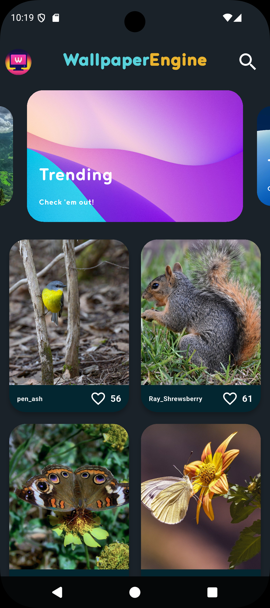
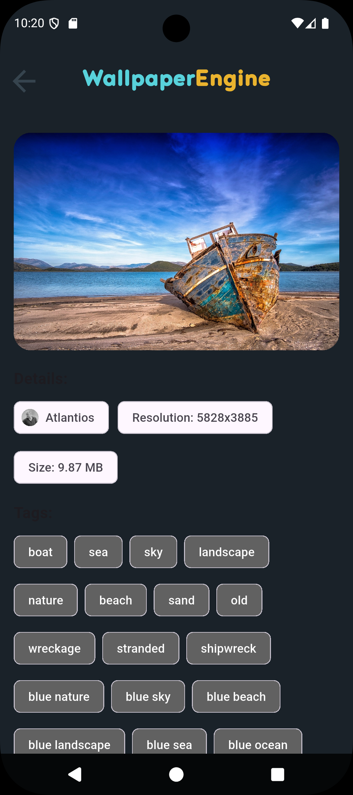
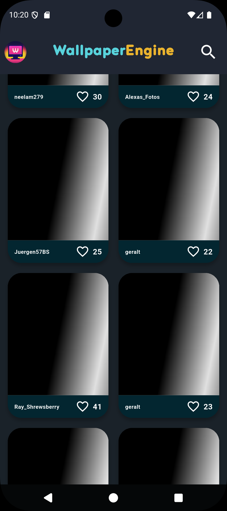

# **WallpaperEngine - A Feature-Rich Wallpaper Browser App**

WallpaperEngine is a sleek, modern, and high-performance wallpaper browsing application built with Flutter. It leverages the Pixabay API to offer a vast collection of high-quality images, presented in a beautifully designed, user-friendly interface. The app is built with a strong focus on modern development practices, including declarative UI, reactive state management, and a clean, scalable architecture.


## **📸 App Showcase**


<table>
  <tr>
   <td><strong>Home Screen</strong>
   </td>
   <td><strong>Details Screen</strong>
   </td>
   <td><strong>Loading State</strong>
   </td>
  </tr>
  <tr>
   <td><em></em>
   </td>
   <td><em></em>
   </td>
   <td><em></em>
   </td>
  </tr>
</table>


**Animated Demo:**

<!--  -->


## **✨ Features**

This application is packed with features designed to provide a seamless and engaging user experience:


* **Dynamic Home Page**: A visually appealing home screen featuring an auto-playing carousel of featured wallpapers.
* **Infinite Scrolling Grid**: Browse an endless stream of wallpapers. The app automatically fetches more images as you scroll to the bottom.
* **Robust Search Functionality**: Instantly search for wallpapers by keywords with a clean, integrated search interface.
* **Advanced State Management**: Built with **Flutter Riverpod** for a reactive, scalable, and robust state management solution that efficiently handles UI updates, data fetching, and error states.
* **Efficient Networking**: Utilizes the **Dio** package for powerful and reliable communication with the Pixabay API.
* **Image Caching & Performance**: Implements **CachedNetworkImage** to efficiently cache and display images, minimizing network usage and improving loading times.
* **Elegant Loading UI**: Displays a professional **shimmer effect** while images are loading, enhancing the perceived performance and user experience.
* **Detailed Wallpaper View**: Tap on any wallpaper to see a detailed view with information about the author, resolution, size, tags, and engagement stats (likes, comments, views).
* **One-Tap Download**: Download high-resolution wallpapers directly to your device with a built-in progress indicator. The app handles all necessary file-saving permissions.
* **Pull-to-Refresh**: Easily refresh the wallpaper feed on the home screen.
* **Custom Theming**: A well-organized, custom theme with a dark, modern color palette for a consistent and polished look.
* **Error Handling**: Gracefully handles network errors and API limitations, providing clear feedback to the user via SnackBars.


## **🛠️ Tech Stack & Architecture**

The project leverages a modern, scalable tech stack and follows best practices for Flutter app development.


* **Core Framework**: Flutter
* **Programming Language**: Dart
* **Architecture**: MVVM-inspired (Model-View-ViewModel) pattern, with the UI (View) separated from the business logic (Notifier/Provider). The code is cleanly organized into layers for models, services, providers, and UI.
* **State Management**: flutter_riverpod - For reactive and decoupled state management across the application.
* **Networking**: dio - A powerful HTTP client for making API requests.
* **UI** &** UX**:
    * shimmer - To create a sophisticated loading animation.
    * cached_network_image - For efficient image caching and display.
    * carousel_slider - For the auto-playing image carousel on the home screen.
* **Device & File System**:
    * path_provider - To find the correct local path to save files.
    * permission_handler - To manage runtime permissions for file storage.
    * open_file - To open the downloaded image file.
* **Branding & Style**:
    * flutter_launcher_icons - To generate app launcher icons.
    * flutter_native_splash - To configure the native splash screen.


## **🚀 How To Run**

To clone and run this application, you'll need Git and Flutter installed on your computer. From your command line:

### 1. Clone this repository 
```
$ git clone https://github.com/ArfanAnulal
```

### 2. Go into the repository 
```
$ cd wallpaper_app
```
 
### 3 .Install dependencies 
```
$ flutter pub get
```
 
### 4 .Run the app 
```
$ flutter run
```


## **🧠 What I Learned**

This project was a comprehensive exercise in building a full-featured Flutter application and deepened my understanding of several key areas:


* **Advanced State Management**: Implementing Riverpod taught me how to manage complex asynchronous state (loading, data, error) in a clean, reactive, and testable way, especially for features like infinite scrolling and live search updates.
* **User Experience Polish**: I learned that a good user experience goes beyond just functionality. Implementing features like the shimmer effect, cached images, and clear download progress indicators significantly improves the perceived quality of the app.
* **Interacting with Device APIs**: Integrating the download feature required a deep dive into handling file system permissions (permission_handler), finding storage paths (path_provider), and interacting with other apps to open the downloaded file (open_file).
* **Clean Architecture**: Structuring the application with a clear separation of concerns (UI, state, services) was crucial for keeping the codebase maintainable and scalable as more features were added.
